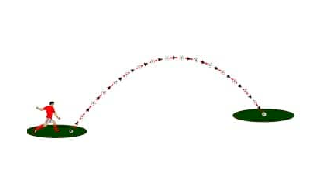

# Modelagem Matemática

Para dar uma visão aplicada ao nosso estudo, começaremos com o problema clássico de física do ensino médio, que é o lançamento oblíquo, ou seja, quando um objeto inicia seu movimento formando um determinado ângulo com a horizontal. Nesse tipo de lançamento, o objeto executa dois movimentos simultâneos, um na vertical e outro na horizontal. 

Problema:

A bala de um canhão, com massa (m) de 15kg, é lançada com velocidade inicial (v0) de 300m/s. Determine o alcance horizontal máximo (A) do projétil para o caso de o ângulo (θ) formado entre o canhão e a horizontal ser de 15°. Considere a gravidade (g) igual a 10m/s.

Dos resultados do ensino médio, utilizaremos a fórmula de alcance máximo para o lançamento oblíquo, dada por: 

Onde:

