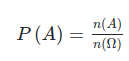

# Probabilidade

## Clássica

Referência: [Probabilidade - Brasil Escola](https://brasilescola.uol.com.br/matematica/probabilidade.htm)

## Empírica (Anotações de Desempenho)

Referência: [Estatística - Brasil Escola](https://brasilescola.uol.com.br/matematica/estatistica-2.htm#:~:text=A%20estat%C3%ADstica%20%C3%A9%20o%20campo,duas%20partes%3A%20descritiva%20e%20inferencial.)

### 1. Uso de Memória
1.1. **Stack Allocation:** É mais rápida em comparação com a alocação dinâmica, mas em programas grandes, a alocação dinâmica se destaca devido ao espaço limitado da stack.

### 2. Performance
2.1. **Stack Allocation:** É mais rápida para a CPU por conta da otimização em tempo de execução.  
2.2. **Heap Allocation:** Pode causar overhead em tempo de execução. Entretanto, em programas grandes, a alocação dinâmica se torna vantajosa devido ao espaço limitado da stack.

### 3. Complexidade
3.1. **Instanciação vs Alocação Dinâmica:** A diferença entre simplesmente instanciar uma variável e alocá-la corretamente é significativa. A alocação dinâmica é mais complexa e exige cuidado para evitar erros.

### Conclusão das Anotações de Desempenho
Para casos simples e diretos, a alocação na stack é eficiente e não apresenta muitos problemas. No entanto, ao trabalhar com um grande número de dados simultaneamente, a alocação na heap é preferível, pois ajuda a economizar memória do processo.
