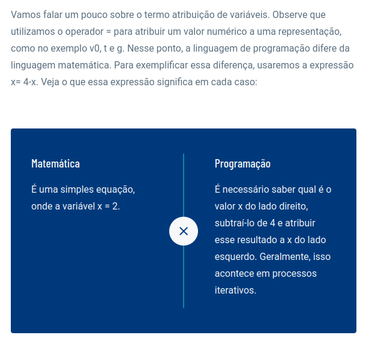

# Modelagem Matemática

Faremos um programa em C (main.c) para avaliar uma fórmula simples. Nosso primeiro exemplo diz respeito à programação de um modelo matemático que calcula a altura de um objeto atirado na direção vertical, partindo de uma altura inicial igual a zero. Da 2ª lei de Newton, e ao assumir uma resistência do ar desprezível, obtemos um modelo matemático que determina a posição vertical y da bola no tempo t:

Onde:

# Tuplas e listas
Ao contrário de linguagens de programação como Python, C não possui um tipo de dados nativo chamado "tupla". No entanto, você pode criar uma estrutura personalizada para simular o comportamento de uma tupla em C. Uma estrutura é uma coleção de diferentes tipos de dados agrupados em um único objeto.

Exemplo simulado de tupla em C (tupla.c)

Neste exemplo, estamos usando uma estrutura chamada Tupla para armazenar um número inteiro, um número de ponto flutuante e uma string. No entanto, lembre-se de que, ao contrário das tuplas em linguagens como Python, as estruturas em C não têm os recursos de imutabilidade e conveniência que as tuplas possuem em outras linguagens. Você precisa gerenciar manualmente a criação, atribuição e manipulação dos valores dentro da estrutura.

Embora as estruturas em C possam ser usadas para criar uma abordagem semelhante a tuplas, vale ressaltar que o uso de estruturas em C é mais geral e flexível, podendo ser usadas para muitos outros propósitos além de simular tuplas.

Resumo: Tuplas nada mais são do que "listas" imutável e que contem elementos de diferentes tipos importantes quanto. Já a lista é uma tupla de apenas um tipo de dado e totalmente mutável.

